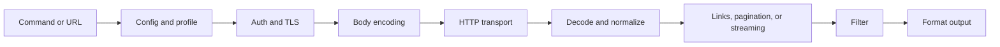

Restish has two entry points into one request pipeline: generic HTTP commands
for immediate access, and API-aware commands generated from OpenAPI for repeated
work.

## The Request Pipeline



The same flags and habits work across the pipeline because Restish keeps the
runtime centralized: config, I/O, content types, spec loading, auth, link
parsing, formatters, and plugins are owned by the CLI runtime.

## Generic Requests

Generic requests need no setup:

```bash
restish https://api.rest.sh/anything/demo
restish post https://api.rest.sh/post 'name: Alice, enabled: true'
```

Use them for exploration, odd jobs, and APIs without a useful description.

## API Commands

API commands start with registration:

```bash
restish api configure example https://api.rest.sh 'prompt.api_key: docs-key'
restish example list-images
```

Generated commands add discoverability, completion, parameter help, and a stable
short name. They still use the same request pipeline.

## Profiles

Profiles hold repeated choices: base URLs, headers, query params, auth, and TLS
settings. Switching profiles changes the request setup without changing the
command shape.

```bash
restish -p staging myapi list-users
```

## Normalized Responses

Restish decodes responses into a stable shape before filtering and formatting.
That is why filters can address `headers`, `links`, and `body` consistently:

```bash
restish https://api.rest.sh/images -f links.next -r
restish https://api.rest.sh/example -f body.basics.profiles
```

## Plugins

Plugins extend specific parts of the runtime: auth, request/response middleware,
loaders, formatters, top-level commands, and TLS signing. Good plugins delegate
HTTP and output back to Restish so user expectations stay consistent.

## Related Pages

- [API Commands](../api-commands/)
- [Profiles](../profiles/)
- [Normalized Responses](../normalized-responses/)
- [Requests](/docs/guides/requests/)
- [Request Execution Design](/docs/contributing/design-records/)
