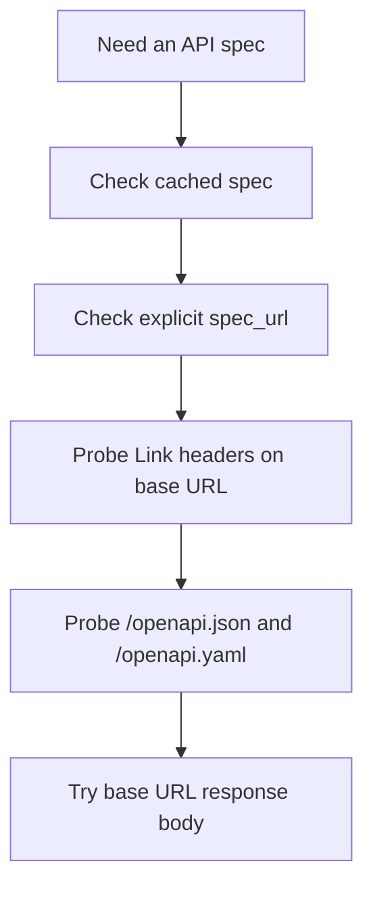

Restish gets much more powerful when it can attach a short API name to a base
URL and a discovered OpenAPI description.

That setup unlocks:

- generated commands
- richer help text
- shell completion
- profile-aware requests without repeating full URLs



## Fastest Path

Register an API:

```bash
restish api configure example https://api.rest.sh
```

You can omit the scheme for ordinary HTTPS APIs:

```bash
restish api configure example api.rest.sh
```

Localhost and loopback targets default to HTTP:

```bash
restish api add local localhost:8080
```

Then inspect what Restish learned:

```bash
restish api list
restish example --help
```

## Project Configs

Use an explicit config file when a project should keep its API registrations
separate from your normal Restish config:

```bash
printf '{}\n' > ./restish.json
restish --rsh-config ./restish.json api configure example https://api.rest.sh
```

Every command in that invocation reads and writes only `./restish.json`. You
can also set the path for a shell session:

```bash
export RSH_CONFIG="$PWD/restish.json"
restish api list
```

If the selected file does not exist, Restish stops with an error instead of
falling back to your global config.

If the OpenAPI description asks setup questions, you can answer them on the
same command line with `prompt.*` expressions. Other expressions use the same
config shorthand as `api set` and apply after discovery:

```bash
restish api configure acme api.example.com \
  prompt.client_id: abc123 \
  prompt.api_key: env:ACME_API_KEY \
  profiles.default.headers[]: "X-Env: prod"
```

## How Discovery Works

When Restish needs a spec, it tries this ordered strategy:

1. cached spec for the API name
2. explicit `spec_url` from config
3. `Link` headers from a `GET` on the base URL
4. well-known paths such as `/openapi.json` and `/openapi.yaml`
5. the base URL response body itself

Network probes run in parallel, and the first successfully parsed spec wins.

## Make Discovery Predictable

If the server does not publish its spec in conventional places, set `spec_url`
or `spec_files` explicitly:

```json
{
  "apis": {
    "example": {
      "base_url": "https://api.rest.sh",
      "spec_url": "https://api.rest.sh/openapi.json"
    }
  }
}
```

Use `spec_files` when you want to point at local files or merge multiple spec
documents in order.

`base_url` and `spec_url` have different jobs:

- `base_url` is the request root Restish uses for API calls
- `spec_url` is only where Restish fetches the OpenAPI document

That matters for APIs that publish docs from a separate path:

```json
{
  "apis": {
    "example": {
      "base_url": "https://api.example.com",
      "spec_url": "https://api.example.com/v3/api-docs"
    }
  }
}
```

If an OpenAPI document includes path elements that should not be repeated in
generated operation URLs, set `operation_base`. This is the v2 replacement for
older setups that effectively ignored part of the API base path:

```json
{
  "apis": {
    "billing": {
      "base_url": "https://billing.example.com/api/v2-beta1",
      "operation_base": "/",
      "spec_url": "https://billing.example.com/openapi.json"
    }
  }
}
```

`operation_base` must be an absolute path such as `/` or `/v1`; it is resolved
against `base_url`.

## Non-Interactive Setup

Use `api add` when you already know the API name and base URL:

```bash
restish api add example https://api.example.com \
  spec_url: https://api.example.com/v3/api-docs \
  profiles.default.headers[]: "Accept: application/json"
```

Use `api set` for later edits:

```bash
restish api set example spec_url: https://api.example.com/openapi.json
restish api set example profiles.default.query[]: "per_page=100"
restish api set example operation_base: /
```

Use `api configure` when you want Restish to discover the spec and apply
`x-cli-config` defaults from it:

```bash
restish api configure example https://api.example.com \
  prompt.api_key: env:EXAMPLE_API_KEY
```

For project-local setup scripts, combine those commands with an explicit
config file:

```bash
restish --rsh-config ./restish.json api add example https://api.example.com
restish --rsh-config ./restish.json api sync example
```

## Generated Command Shape

Generated commands are grouped under the API short name. They behave like
ordinary CLI commands rather than a separate codegen mode.

For example:

```bash
restish example get-image jpeg
```

Generated commands name the operation. Generic HTTP commands name the method
and path. For the same API, these are intentionally different shapes:

```bash
restish example create-repo org: myorg repo: myrepo
restish put example/repos org: myorg repo: myrepo
```

Use the generated command when the OpenAPI operation is known and stable. Use
the generic form when you are exploring, testing a new path, or calling an
endpoint before it appears in the spec.

## Shipping A Preconfigured Experience

API authors can make setup smoother without asking users to run arbitrary code:

- publish a discoverable OpenAPI document
- include `x-cli-config` for safe defaults such as profiles, headers, query
  params, and auth shape
- provide a small setup script that runs `restish api configure` or
  `restish api add` with an explicit config file
- ship command plugins for workflows that are larger than one HTTP operation
- tell users to run `restish api sync <name>` after the spec changes

Remote specs cannot install or approve `external-tool` auth commands
automatically. A spec can describe the auth shape, but local command execution
is a separate trust decision that the user or setup script must configure and
approve on the machine running Restish.

## When To Re-Sync

Run this when the upstream spec changed:

```bash
restish api sync example
```

## When Discovery Fails

Even without a discovered spec, an API registration is still useful because it
can hold `base_url`, profiles, auth settings, TLS options, and pagination
defaults. You can still make generic requests against the saved API name and
add the spec location later.

## Learn More

- [Connect to an API](/docs/getting-started/connect-to-an-api/)
- [Commands Reference](/docs/reference/commands/)
- [API Management Reference](/docs/reference/api-management/)
- [Example API](/docs/reference/example-api/)
