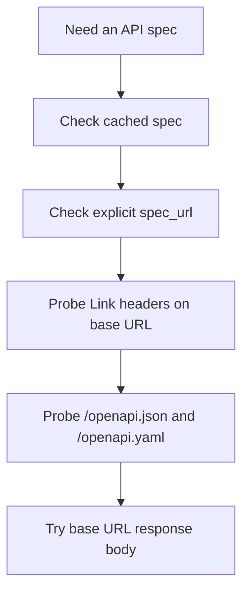

Restish gets much more powerful when it can attach a short API name to a base
URL and a discovered OpenAPI description.

That setup unlocks:

- generated commands
- richer help text
- shell completion
- profile-aware requests without repeating full URLs



## Fastest Path

Register an API:

```bash
restish api configure example https://api.rest.sh
```

You can omit the scheme for ordinary HTTPS APIs:

```bash
restish api configure example api.rest.sh
```

Localhost and loopback targets default to HTTP:

```bash
restish api add local localhost:8080
```

Then inspect what Restish learned:

```bash
restish api list
restish example --help
```

If the OpenAPI description asks setup questions, you can answer them on the
same command line with `prompt.*` expressions. Other expressions use the same
config shorthand as `api set` and apply after discovery:

```bash
restish api configure acme api.example.com \
  prompt.client_id: abc123 \
  prompt.api_key: env:ACME_API_KEY \
  profiles.default.headers[]: "X-Env: prod"
```

## How Discovery Works

When Restish needs a spec, it tries this ordered strategy:

1. cached spec for the API name
2. explicit `spec_url` from config
3. `Link` headers from a `GET` on the base URL
4. well-known paths such as `/openapi.json` and `/openapi.yaml`
5. the base URL response body itself

Network probes run in parallel, and the first successfully parsed spec wins.

## Make Discovery Predictable

If the server does not publish its spec in conventional places, set `spec_url`
or `spec_files` explicitly:

```json
{
  "apis": {
    "example": {
      "base_url": "https://api.rest.sh",
      "spec_url": "https://api.rest.sh/openapi.json"
    }
  }
}
```

Use `spec_files` when you want to point at local files or merge multiple spec
documents in order.

## Generated Command Shape

Generated commands are grouped under the API short name. They behave like
ordinary CLI commands rather than a separate codegen mode.

For example:

```bash
restish example get-image jpeg
```

## When To Re-Sync

Run this when the upstream spec changed:

```bash
restish api sync example
```

## When Discovery Fails

Even without a discovered spec, an API registration is still useful because it
can hold `base_url`, profiles, auth settings, TLS options, and pagination
defaults. You can still make generic requests against the saved API name and
add the spec location later.

## Learn More

- [Connect to an API](/docs/getting-started/connect-to-an-api/)
- [Commands Reference](/docs/reference/commands/)
- [API Management Reference](/docs/reference/api-management/)
- [Example API](/docs/reference/example-api/)
