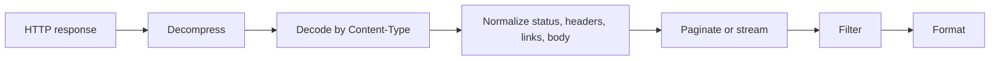

Restish output is built around one rule: document formats produce one coherent
result, while record formats can emit one item or event at a time.

## Processing Model



## Choose A Format

```bash
restish https://api.rest.sh/images
restish https://api.rest.sh/images -o json
restish https://api.rest.sh/images -o yaml
restish https://api.rest.sh/images -o table --rsh-columns name,format,self
restish https://api.rest.sh/images -o ndjson -f body.self
```

`readable` is the normal interactive default and is optimized for humans on a
terminal. `json`, `yaml`, and `cbor` are document formats. `ndjson` is a record
format for streaming or shell pipelines.

## Document vs Record Output

Use document output when the next program expects one complete value:

```bash
restish https://api.rest.sh/images --rsh-collect -o json > images.json
```

Use record output when you want one item per line:

```bash
restish https://api.rest.sh/images -o ndjson -f body.self
```

This distinction matters for pagination and live streams. A live stream may
never finish, so `-o ndjson` is the right shape for structured stream output.

## Filters Change What Gets Rendered

```bash
restish https://api.rest.sh/example -f body.basics.profiles
restish https://api.rest.sh/images -f '.body[] | select(.format == "jpeg") | .name' -r
restish https://api.rest.sh/ -f headers.Content-Type -r
```

Use `-r` when the filtered value is a scalar and shell tools should not receive
JSON quotes.

## Raw Bytes And Files

Use `-o raw` when exact bytes matter:

```bash
restish https://api.rest.sh/images/jpeg -o raw > dragonfly.jpg
restish https://api.rest.sh/bytes/64 -o raw > sample.bin
```

Verbose diagnostics go to stderr, so body redirects stay clean:

```bash
restish -v https://api.rest.sh/images/jpeg -o raw > dragonfly.jpg 2> dragonfly.headers.txt
```

## Images In The Terminal

Image responses can render in capable terminals:

```bash
restish https://api.rest.sh/images/png -o image
restish -H 'Accept: image/png' https://api.rest.sh/image -o image
```

Use `-o raw` to save the image instead.

## Greppable Output

`gron` prints paths and values, which is useful when you do not know the shape:

```bash
restish https://api.rest.sh/example -o gron | grep -i github
```

## Related Pages

- [Normalized Responses](/docs/concepts/normalized-responses/)
- [Filtering](../filtering/)
- [Output Formats](/docs/reference/output-formats/)
- [Output Defaults](/docs/reference/output-defaults/)
