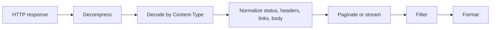

Restish output is built around one rule: document formats produce one coherent
result, while record formats can emit one item or event at a time.

## Processing Model



## Choose A Format


restish api.rest.sh/images



restish api.rest.sh/images -o json



restish api.rest.sh/images -o yaml



restish api.rest.sh/images -o table --rsh-columns name,format,self


```bash
restish api.rest.sh/images -o ndjson -f body.self
```

Use shortcuts for common response metadata:

```bash
restish api.rest.sh/status/204 --rsh-status
restish api.rest.sh/ --rsh-headers
```

`readable` is the normal interactive default and is optimized for humans on a
terminal. `json`, `yaml`, and `cbor` are document formats. `ndjson` is a record
format for structured streams, and `lines` is for shell-friendly scalar values.

## Document vs Record Output

Use document output when the next program expects one complete value. Make the
format explicit in scripts and redirects:

```bash
restish api.rest.sh/images --rsh-collect -o json > images.json
```

Use record output when you want one item per line:


restish api.rest.sh/images -o ndjson -f body.self


This distinction matters for pagination and live streams. A live stream may
never finish, so `-o ndjson` is the right shape for structured stream output.
Restish rejects `-o json` on stream responses with an error that points to
`-o ndjson`.

Output format does not change paginated filter scope. Without `--rsh-collect`,
Restish filters each item; document formats then render the filtered item
results as one complete document.

## Filters Change What Gets Rendered


restish api.rest.sh/example -f body.basics.profiles


```bash
restish api.rest.sh/images --rsh-collect -f '.body[] | select(.format == "jpeg") | .name' -o lines
restish api.rest.sh/ -f headers.Content-Type
```

Explicit scalar filters print without JSON string quotes. Use `-o lines` when
the filtered value is an array or stream of scalar values and shell tools should
receive one value per line. Use `-o json` when a script needs the selected value
as JSON.

## Raw Bytes And Files

Unfiltered responses redirect as body bytes by default. This includes JSON,
CBOR, YAML, images, octet streams, zip files, text, and unknown payloads:

```bash
restish api.rest.sh/images/jpeg > dragonfly.jpg
restish api.rest.sh/bytes/64 > sample.bin
restish api.rest.sh/content/cbor > response.cbor
```

Choose an output format when you want Restish to transform the decoded body:

```bash
restish api.rest.sh/content/cbor -o json > response.json
```

Use raw output explicitly when you want body bytes even on a terminal:

```bash
restish api.rest.sh/bytes/64 --rsh-raw > sample.bin
```

Raw output bypasses Restish's structured body decoding and formatting for
presentation, but it is still based on the body after HTTP content-encoding
decompression. `raw` is not an `-o` format and raw mode cannot be combined with
filters.

Verbose diagnostics go to stderr, so body redirects stay clean:

```bash
restish -v api.rest.sh/images/jpeg > dragonfly.jpg 2> dragonfly.headers.txt
```

Sensitive headers such as `Authorization`, `Cookie`, `Proxy-Authorization`,
`Set-Cookie`, and common API-key headers are redacted in verbose diagnostics and
in human/table response preambles. Use explicit body or header filters when you
need a specific non-sensitive field.

## Images In The Terminal

Image responses can render in capable terminals:

```bash
restish api.rest.sh/images/png -o image
restish -H 'Accept: image/png' api.rest.sh/image -o image
```

Redirect the response to save the image instead.

## Greppable Output

`gron` prints paths and values, which is useful when you do not know the shape:

```bash
restish api.rest.sh/example -o gron | grep -i github
```

## Related Pages

- [Normalized Responses](/docs/concepts/normalized-responses/)
- [Filtering](../filtering/)
- [Output Formats](/docs/reference/output-formats/)
- [Output Defaults](/docs/reference/output-defaults/)
