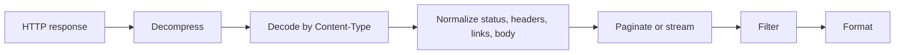

Restish output is built around one rule: document formats produce one coherent
result, while record formats can emit one item or event at a time.

## Processing Model



## Choose A Format


restish https://api.rest.sh/images



restish https://api.rest.sh/images -o json



restish https://api.rest.sh/images -o yaml



restish https://api.rest.sh/images -o table --rsh-columns name,format,self


```bash
restish https://api.rest.sh/images -o ndjson -f body.self
```

`readable` is the normal interactive default and is optimized for humans on a
terminal. `json`, `yaml`, and `cbor` are document formats. `ndjson` is a record
format for structured streams, and `lines` is for shell-friendly scalar values.

## Document vs Record Output

Use document output when the next program expects one complete value. Redirected
structured output defaults to JSON, so this does not need `-o json`:

```bash
restish https://api.rest.sh/images --rsh-collect > images.json
```

Use record output when you want one item per line:


restish https://api.rest.sh/images -o ndjson -f body.self


This distinction matters for pagination and live streams. A live stream may
never finish, so `-o ndjson` is the right shape for structured stream output.

## Filters Change What Gets Rendered


restish https://api.rest.sh/example -f body.basics.profiles


```bash
restish https://api.rest.sh/images -f '.body[] | select(.format == "jpeg") | .name' -o lines
restish https://api.rest.sh/ -f headers.Content-Type
```

Explicit scalar filters print without JSON string quotes. Use `-o lines` when
the filtered value is an array or stream of scalar values and shell tools should
receive one value per line. Use `-o json` when a script needs the selected value
as JSON.

## Raw Bytes And Files

Image responses redirect as body bytes by default:

```bash
restish https://api.rest.sh/images/jpeg > dragonfly.jpg
```

For generic byte streams, use raw output explicitly:

```bash
restish https://api.rest.sh/bytes/64 --rsh-raw > sample.bin
```

Raw output bypasses Restish's structured body decoding and formatting, but it
is still based on the body after HTTP content-encoding decompression. Use
`-r` or `--rsh-raw` for raw response body bytes; `raw` is not an `-o` format
and raw mode cannot be combined with filters.

Verbose diagnostics go to stderr, so body redirects stay clean:

```bash
restish -v https://api.rest.sh/images/jpeg > dragonfly.jpg 2> dragonfly.headers.txt
```

## Images In The Terminal

Image responses can render in capable terminals:

```bash
restish https://api.rest.sh/images/png -o image
restish -H 'Accept: image/png' https://api.rest.sh/image -o image
```

Redirect the response to save the image instead.

## Greppable Output

`gron` prints paths and values, which is useful when you do not know the shape:

```bash
restish https://api.rest.sh/example -o gron | grep -i github
```

## Related Pages

- [Normalized Responses](/docs/concepts/normalized-responses/)
- [Filtering](../filtering/)
- [Output Formats](/docs/reference/output-formats/)
- [Output Defaults](/docs/reference/output-defaults/)
